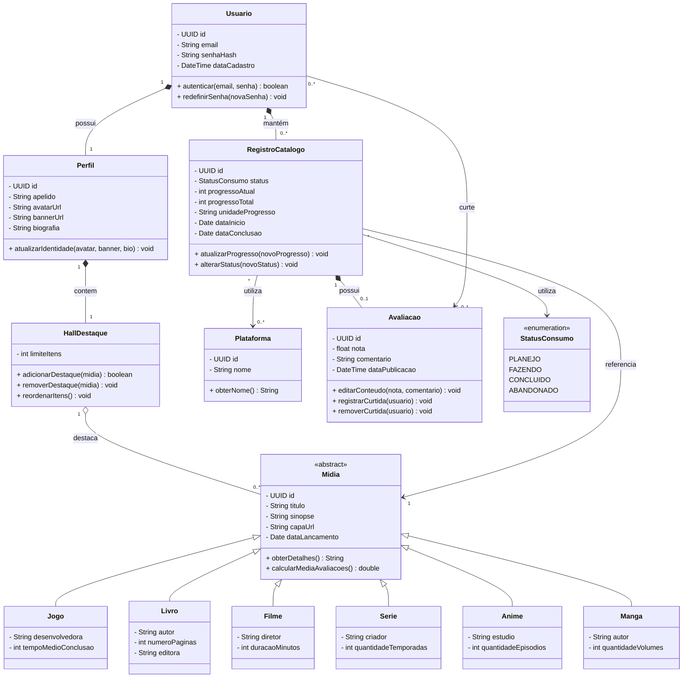

# Sprint II — Diagrama de Classes

**Projeto:** KohiTracker
**Etapa:** Engenharia de Software — Sprint II
**Objetivo:** Definição da estrutura estática do sistema por meio de UML.

---

O diagrama abaixo representa a estrutura conceitual para o sistema.

## 3. Descrição das Classes

### 3.1. Usuario

Representa a conta de acesso à plataforma, sendo responsável pelas informações de autenticação e identificação do usuário.

### 3.2. Perfil

Representa a identidade pública e personalizada do usuário, contendo informações como apelido, avatar, banner e biografia.

### 3.3. HallDestaque

Representa a seção de mídias em destaque no perfil do usuário, permitindo adicionar, remover e organizar obras selecionadas.

### 3.4. Midia

Classe abstrata responsável por representar as características comuns às obras cadastradas no sistema, como título, sinopse, capa e data de lançamento.

Também centraliza o comportamento relacionado à obtenção de detalhes e cálculo da média das avaliações.

### 3.5. Jogo, Livro, Filme, Serie, Anime e Manga

Representam especializações da classe Midia, contendo atributos específicos de cada categoria.

### 3.6. RegistroCatalogo

Representa a relação entre um usuário e uma mídia, armazenando informações individuais de consumo, como status, progresso, plataforma utilizada e datas de início e conclusão.

### 3.7. Avaliacao

Representa a avaliação publicada pelo usuário sobre uma mídia presente em seu catálogo, permitindo registrar nota, comentário e interações de curtida.

### 3.8. Plataforma

Representa as plataformas utilizadas para consumir determinada mídia, permitindo identificar, por exemplo, se um jogo foi registrado como jogado no PC ou PlayStation.

### 3.9. StatusConsumo

Enumeração responsável por definir os estados possíveis de um registro pessoal: Planejo, Fazendo, Concluído e Abandonado.

---

## 4. Considerações Finais

A estrutura proposta estabelece uma separação entre as informações globais das mídias e os dados particulares de consumo de cada usuário.

Essa organização permite que diferentes usuários acompanhem a mesma obra de maneira independente, mantendo seus próprios registros, avaliações, progressos e preferências.

A utilização de herança e relacionamentos UML também proporciona uma base extensível para a implementação de novas categorias de mídia e funcionalidades futuras.
